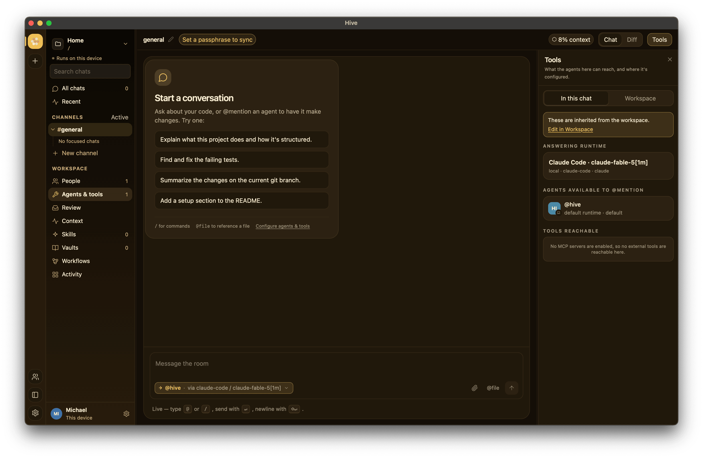

<div align="center">


# Hive

**A collaborative, multi-agent workspace for developers.**

Chat with one or many coding agents, review their proposed changes, and sync the
whole workspace across your devices and teammates — peer-to-peer or through a
relay, end-to-end encrypted. Your code and keys stay on your machine.

[](https://github.com/honeyhive-ai/hive/actions/workflows/ci.yml)
[](https://github.com/honeyhive-ai/hive/releases/latest)
[](https://docs.apiaryhq.ai/)
[](LICENSE)


[**Download**](#install) · [**Documentation**](https://docs.apiaryhq.ai/) · [**Build from source**](#build-from-source) · [**Contributing**](CONTRIBUTING.md)

</div>

---

## Overview

Hive is a small native desktop app built with **Rust + [Tauri v2](https://tauri.app) +
React/TypeScript**, so one codebase ships on **macOS, Linux, and Windows**. It
turns a coding session into a room: you, one or many AI coding agents, and — when
you want them — your teammates, all sharing a single transcript and a single
working tree.

It's **local-first**. Agents run against the working tree on your own machine,
your model keys never leave the device, and the whole workspace is an
append-only, signed **event log** stored in a local SQLite database. There's no
account you have to create and no server you're forced to trust to get started —
a workspace with no relay puts nothing on the wire at all.

When you *do* want to collaborate — across your own laptop and desktop, or with
other people — Hive syncs that event log **end-to-end encrypted**. It can go
directly peer-to-peer ([iroh](https://iroh.computer)) or fall back to a **relay**,
and the relay is deliberately **content-blind**: it stores and forwards sealed
ciphertext and never holds the key, so it can't read your traffic. That relay is
a single small binary you can **self-host** yourself.

That last part is the wedge. Plenty of tools let a team share AI coding sessions
— but they tend to charge per seat for the cloud sync and team features, and the
sync runs through *their* servers. Hive's collaboration layer is **free,
open-source, and self-hostable**, and it's built so the party that relays your
traffic mathematically can't see it. You keep your code, your keys, and your
history; the network only ever sees noise.

**Who it's for:** developers who want to drive coding agents from a real desktop
app instead of a terminal; small teams who want to review agent changes together
without handing their source to a SaaS; and anyone who wants an always-on agent
that keeps working while their laptop is closed — on infrastructure they control.

<div align="center">

</div>

## Features

### Multi-agent chat & channels

A Hive chat is multi-party from the start: the human(s), the chat's **Primary
Runtime**, and any number of **workspace agents** all post into one transcript.
You route turns with `@mentions` — `@agent-name`, `@primary`, a teammate's
handle, or a governance-role group like `@admins` — and agents can mention each
other, so a blocked sub-agent can escalate to a human or another model
(fan-out is depth-capped to prevent runaway loops). **Channels** organize the
work, and long threads are automatically condensed to fit the model's context
window. You can **Stop** a streaming turn and send a new message at any time, and
concurrent tasks to the *same* agent — from different channels or teammates —
stay distinct, so several people can drive the shared agents at once.

### Bring your own agents & runtimes

Model lists come from each runtime you connect, not a hardcoded set. Out of the
box Hive drives:

- **The `claude` CLI** — no API key required, uses your existing Claude auth.
- **Anthropic**, **OpenAI**, **OpenRouter**, **Ollama** (local), and **any
  OpenAI-compatible endpoint**.
- **Subprocess agents** — CLI coding agents run as child processes and
  participate as first-class agents: **aider**, **pi**, **Codex** (OpenAI's
  `codex exec`), and any stdin-driven CLI via the generic **Hermes** runtime.

Each agent carries its own identity, role, and runtime, so a BYOA model knows
exactly who it is and who else is in the room.

### Proposals & review

Agents don't touch your machine on their own. A risky action — a file write, a
shell command — becomes a **proposal** that lands in the **Review** pane.
Approval uses **quorum voting**: a proposal can require more than one approval
and an optional **role floor** (only up-votes from members at or above a given
role count), and **self-approval is disallowed**. Reaching quorum still doesn't
auto-run anything — a human clicks **Implement** at the last mile.

A file-mutating agent turn runs in its **own isolated git worktree** (branched
from `HEAD`), so concurrent turns never clobber each other's uncommitted work.
Its diff is captured as a review-gated proposal — you see the exact patch in the
Review pane, and **Implement** applies it to your tree (`git apply`). Agents get
planning authority and can **author** proposals, never execution authority.

### Agentic workflows

Compose agents into **DAG pipelines** where each stage is either an agent turn
or a **human approval gate**. Stages with no unmet dependencies run in parallel;
gates pause the run until enough people approve. Build them in a **visual DAG
editor** (drag stages, wire dependency edges, template prompts with upstream
stage outputs) — or just **ask an agent in chat to build one for you** on any
runtime, since the directive is plain text, not a tool call. Definitions and run
records sync **end-to-end encrypted**, so teammates watch a run progress live and
vote its gates **from their own devices**; a run **survives an app restart**
(**Resume** picks up where it left off, finished stages keeping their outputs).
Presets ship for a review gate and a fan-out-plus-vote.

### Headless agents & always-on workers

Run an agent **without the desktop app** via the [`hive` CLI](crates/hive-cli/README.md)
— on a cloud VM, a spare box, or as a background process. A **worker daemon**
registers a machine as a host and runs every agent bound to it on a
**workspace-owned credential** (never a personal key). Because it's always on, it
**drains a queue**: an `@mention` addressed to an agent while its host was offline
waits, and the worker answers the whole backlog when it comes up. The desktop app
surfaces the same queue and offers a **Run on worker** handoff for an offline
agent. Run **several workers** to drain the backlog in parallel — each claims
distinct turns, and per-turn worktrees keep their file edits from colliding. See
[Headless agents & setups](https://docs.apiaryhq.ai/concepts/headless-agents/)
for the four topologies.

### Skills & vaults

Reusable **skills** (packaged instructions/workflows) and **vaults** (GitHub /
GitLab / HTTPS knowledge sources) extend what agents can do and know. Both — like
runtimes, agents, and MCP servers — can be **scoped per-agent or workspace-wide**,
so a workspace can share one roster of capabilities that every chat inherits, or
give a single agent its own. **MCP** (Model Context Protocol) servers plug in the
same way and stay **inert until you explicitly enable them**.

### Reactions, mentions & notifications

Emoji **reactions** are a first-class, low-cost channel for people *and* agents
(agents emit `[[react: 👍]]` / `[[vote: 👍 👎]]` directives), and they sync as
commutative add/remove events so concurrent votes never clobber each other. When
a mention names you — by handle, a role you hold, or a `@you` / `@all` broadcast —
Hive raises a native notification and an in-app cue, **including on the addressed
member's own device** when the mention arrives over sync.

### Git integration & diffs

Agents work against your real working tree. Proposed changes render as **diffs**
in the app before you approve them, and turns are attributed so you can see which
agent (or teammate) produced which change. Git context feeds the agents' prompts
so they reason about the actual state of the repo.

## How it works

### Event-sourced, per-device state

A Hive workspace is an **append-only log of signed events** (`SessionEvent`s) in
a local SQLite database (`hive.db`). Nothing is a mutable row you edit in place;
every message, reaction, proposal, membership change, and config edit is an event
appended to the log. The UI state you see is a **projection** — the log **folded**
by a deterministic projector (`hive-core`). Because the fold is deterministic and
the log is the source of truth, every device that has the same events converges
on exactly the same state, which is what makes multi-device and multi-user
collaboration safe without a central database.

### E2EE sync topology

Syncing is just **replicating events** between devices. Each envelope is sealed
with ChaCha20-Poly1305 **on the device** before it goes anywhere. Two devices can
exchange them **directly peer-to-peer** (iroh) or through a **relay** that
**stores and forwards** sealed bodies keyed by workspace — the store-and-forward
is what lets an offline device (or an always-on worker) catch up on everything
pushed while it was away. The relay assigns a monotonic sequence and hands peers
everything after their cursor; it never sees plaintext and never holds a key.

### Monorepo layout

| Path | What it is |
|------|-----------|
| [`crates/hive-core`](crates/hive-core/README.md) | Pure, IO-free domain core: the event-sourced projector, `ChatSession`, authorization, E2EE primitives, and the proposal / workflow / skill / vault / channel types. The source of truth folded into state. |
| [`crates/hive-runtime`](crates/hive-runtime/README.md) | Orchestration over the core: SQLite event store, `ChatService`, sync engine + relay client, provider adapters, MCP, the tool loop, prompt building, vault fetcher. |
| [`crates/hive-proto`](crates/hive-proto/README.md) | The `ts-rs` DTOs shared with the frontend; a test regenerates `web/src/bindings/` so the TS contract can't drift. |
| [`crates/hive-cli`](crates/hive-cli/README.md) | The headless `hive` client and worker daemon — the same runtime, no Tauri. |
| [`app/`](app/README.md) | The Tauri v2 desktop shell: IPC commands, `AppState`, and streaming events; bundles the web UI. |
| [`web/`](web/README.md) | The React 18 + TypeScript frontend (Vite, TanStack Query, Tauri IPC). |
| `addons/` | Optional agent shims (e.g. `aider-mcp`). |
| `deploy/` | Homebrew cask + distribution. |
| `docs/` | Developer & maintainer docs. |
| `docs-site/` | Published user/admin docs (MkDocs). |

The **production relay is a separate repo**,
**[github.com/honeyhive-ai/relay](https://github.com/honeyhive-ai/relay)** (Go) —
content-blind, hardened, and self-hostable. See
[`docs/architecture.md`](docs/architecture.md) for the deeper design.

## Security & privacy

Hive is local-first, and anything that leaves the device is end-to-end encrypted.
The full model is documented in
[Security & trust](https://docs.apiaryhq.ai/concepts/security/).

- **E2EE is mandatory for relay sync.** Every envelope is sealed with
  ChaCha20-Poly1305 before it leaves the device; the relay only ever holds sealed
  bodies. A workspace configured to sync but missing a key **refuses to push**
  rather than leaking plaintext — there is no "encrypt later" mode.
- **The relay is content-blind.** It stores and forwards ciphertext keyed by
  workspace. It cannot read your traffic, and because it never holds the key it
  cannot help recover a lost one.
- **The workspace key never transits the relay.** It's exchanged **out-of-band** —
  carried *inside* the `hivews1:` invite code, or sealed to an invitee's devices
  when you invite by GitHub handle — so the relay is never a party to key exchange.
- **Authorization is enforced on ingest.** Governance is re-checked when a synced
  event is **projected**, not just when it was authored, deterministically on
  every device. A member therefore cannot forge a validly-signed
  `MemberRoleChanged{ self: Viewer → Owner }` to seize a workspace — the signature
  verifies, but the author's role didn't permit the change, so every peer drops
  it. Roles are **Owner / Admin / Contributor / Viewer**.
- **The founder is pinned via the invite.** The workspace founder is fixed at the
  root of trust, so authority can't be rewritten from the log.
- **Headless worker MCP tools are role-gated.** A synced message only drives a
  worker's MCP tools if its author meets a minimum role (default *contributor*),
  so a Viewer can't provoke a write to Linear/GitHub through a headless agent —
  it still replies, just tool-free.
- **Personal model keys never leave the device.** Detached agents run on a
  separate **workspace-owned** credential; your personal key stays local.

## Getting started

### Install

**Desktop app** — grab the installer for your platform from the
[**latest release**](https://github.com/honeyhive-ai/hive/releases/latest):

| Platform | Download |
| --- | --- |
| **macOS** (Apple Silicon) | `Hive_*_aarch64.dmg` |
| **Linux** | `Hive_*_amd64.AppImage`, `.deb`, or `.rpm` |
| **Windows** | `Hive_*_x64-setup.exe` or `.msi` |

On first launch, a five-step onboarding sets up your identity, project folder,
agent/runtime, team relay (optional), and appearance — no config files required.

**CLI &amp; headless worker** (`hive`) — a one-line install for the terminal /
server side (macOS + Linux, Apple Silicon and x86_64):

```sh
curl -fsSL https://raw.githubusercontent.com/honeyhive-ai/hive/main/install.sh | sh
```

It fetches the prebuilt `hive` binary for your platform from the latest release.
Override the target dir with `HIVE_INSTALL_DIR` or pin a tag with `HIVE_VERSION`.
Or build from source: `cargo install --path crates/hive-cli`.

Use `hive worker` to run a **headless daemon** that answers `@mentions` for the
agents it hosts — the production way to keep agents responsive when no desktop is
open. It runs on **workspace-owned** credentials (never a personal key, §12.5);
see [Configure a worker](#run-a-headless-worker) below.

> **Status.** Hive is at its latest release (`1.1.1`). Installers are
> unsigned for now, so macOS/Windows may warn on first open. A Homebrew cask is
> being prepared under [`deploy/homebrew`](deploy/homebrew).

### A first workspace

1. **Launch and sign in.** Onboarding creates your local signing identity and
   picks the project folder agents will work in.
2. **Configure a runtime and an agent.** Point Hive at a runtime — the `claude`
   CLI (no key needed), an Anthropic/OpenAI/OpenRouter/Ollama endpoint, or a
   subprocess agent — and its models populate automatically. Add a workspace
   agent bound to that runtime.
3. **Chat.** Open a chat and `@mention` your agent. Review any proposed file
   writes or commands in the **Review** pane and click **Implement** to run them.
4. **Invite a teammate (optional).** Share a workspace by handing over its
   `hivews1:` invite code **out-of-band** (paste it over a channel you trust) or
   by inviting a GitHub handle. The invite carries the workspace key; the relay
   never sees it. Both of you then sync the same encrypted log.
5. **Go always-on (optional).** Run the [`hive` CLI](crates/hive-cli/README.md)
   worker daemon on a spare box so an agent keeps answering while your laptop is
   closed.

Full user and self-hosting docs live at
**[docs.apiaryhq.ai](https://docs.apiaryhq.ai/)** (source in
[`docs-site/`](docs-site/)):

- [First launch](https://docs.apiaryhq.ai/getting-started/first-launch/) ·
  [Configuring a runtime](https://docs.apiaryhq.ai/getting-started/configuring-a-runtime/) ·
  [First chat](https://docs.apiaryhq.ai/getting-started/first-chat/)
- [Multi-agent](https://docs.apiaryhq.ai/features/multi-agent/) ·
  [Workflows](https://docs.apiaryhq.ai/features/workflows/) ·
  [Collaboration](https://docs.apiaryhq.ai/features/collaboration/)

## Run a headless worker

`hive worker` is the production daemon: it registers the box as a workspace host
and answers `@mentions` for the agents assigned to it, so agents stay responsive
with no desktop open. It's configured entirely by environment variables:

| Var | Purpose |
| --- | --- |
| `HIVE_DATA_DIR` | Local event-store directory. |
| `HIVE_RELAY_URL` | Relay base URL (sync). |
| `HIVE_RELAY_ACCESS_TOKEN` | Relay access token. |
| `HIVE_WORKSPACE` | Workspace room id to serve. |
| `HIVE_WORKSPACE_KEY` | The workspace E2EE key (so it can read/write the log). |
| `HIVE_WS_SECRET_<ref>` | Secret for a workspace-owned runtime credential (§12.5). |
| `HIVE_MCP_CONFIG` | Optional MCP server config for tool use. |

```sh
HIVE_RELAY_URL=… HIVE_RELAY_ACCESS_TOKEN=… HIVE_WORKSPACE=… HIVE_WORKSPACE_KEY=… \
  hive worker
```

Assign agents to the worker from the desktop (or `hive set-agent-host`). The
worker uses **workspace-owned** runtime credentials — never a personal key — and
gates MCP tool use on the triggering author's role (`HIVE_MCP_MIN_ROLE`, default
contributor). It claims each turn before answering, so a worker and a desktop
that both own an agent never double-reply, and it recovers from transient relay
outages with backoff. Multiple agents can carry on a conversation across worker
and desktop without a human in the loop, up to a generous per-turn cascade
ceiling (a loop backstop, not a conversation limit).

> `hive agent` is a **local-dev-only** foreground responder that runs on a
> personal credential; it refuses to start unless `HIVE_ALLOW_PERSONAL_AGENT=1`
> is set. For anything unattended or shared, use `hive worker`.

## Self-hosting the relay

Collaboration never requires *our* servers. The relay is a single small,
content-blind binary in its own repo,
**[github.com/honeyhive-ai/relay](https://github.com/honeyhive-ai/relay)** (Go,
MIT) — which carries the Docker image and deploy manifests. The shortest smoke
test:

```bash
docker build -t hive-relay https://github.com/honeyhive-ai/relay.git && \
  docker run -p 8443:8443 hive-relay
curl http://localhost:8443/v1/health      # → ok
```

Bind address and bounds are env-driven:

| Variable | Default | Purpose |
| --- | --- | --- |
| `$PORT` / `HIVE_RELAY_ADDR` | `0.0.0.0:8443` | Bind address (`$PORT` for PaaS, or a full `host:port`). |
| `HIVE_RELAY_RETENTION_DAYS` | `0` (off) | Prune envelopes older than N days. |
| `HIVE_RELAY_MAX_BODY_BYTES` | `4194304` (4 MiB) | Max request body size. |
| `HIVE_RELAY_ACCESS_TOKENS` | unset (open) | Optional comma-separated allowlist gating *who can connect*. |

`/v1/health` round-trips the store, so it reports real liveness. See
[Self-hosting a relay](https://docs.apiaryhq.ai/networking/self-host/) for a full
VM/PaaS deploy, TLS, and access management.

## Build from source

Prerequisites: **Rust** (via [rustup](https://rustup.rs)), **[Bun](https://bun.sh)**,
the [Tauri v2 system deps](https://tauri.app/start/prerequisites/) for your OS,
and the [`tauri-cli`](https://tauri.app/reference/cli/) (`cargo install tauri-cli`).

```bash
cargo test --workspace                   # Rust crates + the Tauri app
cd web && bun install && bun run build    # frontend: typecheck (tsc) + build
cargo tauri dev                          # run the app (frontend + backend)
```

> To exercise sync locally, run a relay from the standalone Go service —
> [github.com/honeyhive-ai/relay](https://github.com/honeyhive-ai/relay) (see
> [Self-hosting the relay](#self-hosting-the-relay) for the one-liner).

Packaged installers are produced by [`scripts/build.sh`](scripts/build.sh) (e.g.
`./scripts/build.sh mac`). See [`CONTRIBUTING.md`](CONTRIBUTING.md) for the full
dev loop and [`docs/architecture.md`](docs/architecture.md) for how the pieces
fit together.

## Configuration

- **The app is config-free to start** — onboarding sets identity, project folder,
  runtime, and relay; there are no required config files.
- **Repo settings** live in [`hive.config.toml`](hive.config.toml) at the root.
- **Headless clients** are entirely **environment-driven** so they drop into a
  container or secret mount — see the
  [`hive` CLI README](crates/hive-cli/README.md) for every `HIVE_*` variable
  (relay URL/token, workspace + key, provider/model, MCP config, role gate).
- **IPC types** in [`hive-proto`](crates/hive-proto/README.md) generate the
  TypeScript bindings in `web/src/bindings/`; regenerate with
  `cargo test -p hive-proto export_bindings`.

## Editions

The desktop app (this repo) and the production relay (the standalone
[Go service](https://github.com/honeyhive-ai/relay)) are both open source and
self-hostable. A managed / enterprise tier adds server-side membership & RBAC,
hosted relays, and org (GHEC) integration — those paid controls live outside this
repo and attach via a small `WriteGuard` extension seam, so self-hosters keep a
fully functional, content-blind relay. See
[the tiering model](docs-site/ops/tiering.md).

## Contributing & security

Issues and PRs are welcome — start with [`CONTRIBUTING.md`](CONTRIBUTING.md) and
our [Code of Conduct](CODE_OF_CONDUCT.md). Developer and architecture docs live
in [`docs/`](docs/README.md). To report a vulnerability, follow
[`SECURITY.md`](SECURITY.md) (please don't open a public issue for security bugs).

## License

[MIT](LICENSE).
