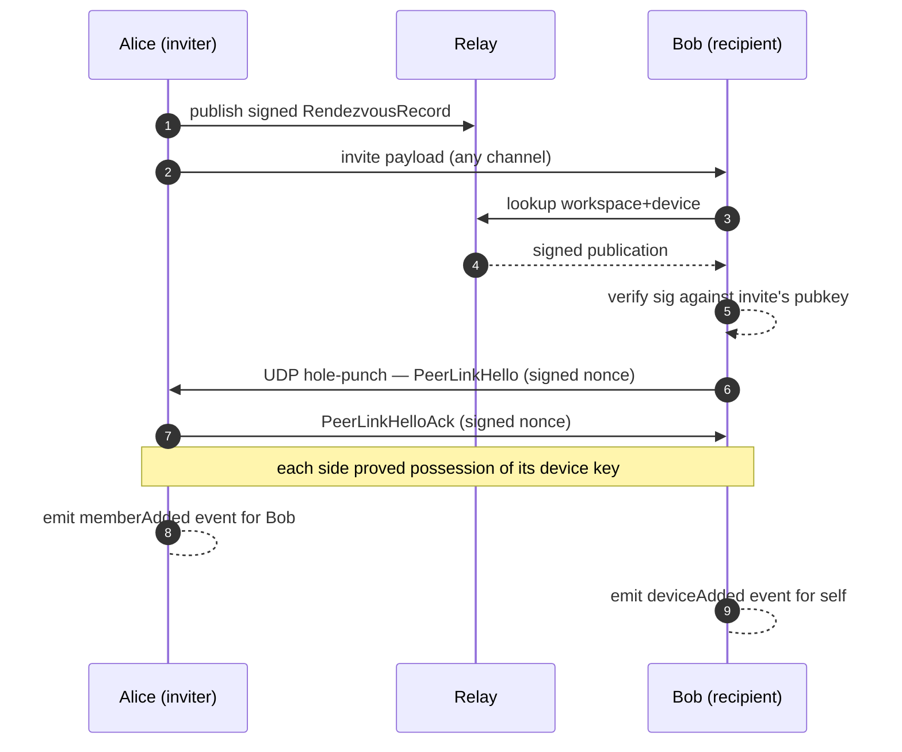

# Identity & devices

Hive distinguishes three layers of identity:

| Layer    | Stable? | Where it lives                                            |
|----------|---------|-----------------------------------------------------------|
| Account  | yes     | public records as JSON in the app data dir; private seed in `keys/` |
| Device   | yes per device | public in the device roster; private Ed25519 seed in `keys/` |
| Workspace member | per workspace | the SQLite event store, as `memberAdded` events |

The app data directory is `com.hive.desktop` (e.g. on macOS
`~/Library/Application Support/com.hive.desktop/`).

## Account

An `HumanAccount` represents you-the-person across machines. It
carries a display name, a handle (`@you`), and an Ed25519 *account*
public key. The account key is the root of trust for every device
you authorize.

You get one account per Hive install on first launch. The
generation is silent — Hive reads `$USER`/hostname for defaults you
can edit in onboarding.

## Device

A `DeviceIdentity` represents one machine. It has:

- A device-specific Ed25519 keypair (private seed on disk in the
  data dir's `keys/`, public in the workspace device roster).
- A `DeviceCertificate` signed by the account key, asserting "this
  device belongs to this account."

Every signed envelope carries the `signerDeviceID`. Receiving peers
look up the device's public key in the workspace device roster and
verify.

## Workspace membership

When you join a workspace, an `memberAdded` event lands in the log
with your `ActorIdentity` (id + display name + kind). Subsequent
events from your devices verify against the rosters.

## What travels in invites

A `WorkspaceInvitePayload` (the thing you paste into a peer's Hive
to grant access) contains:

- The workspace UUID + display name.
- The inviter's `accountID` + `deviceID` + `displayName`.
- The inviter's device Ed25519 public key (the recipient uses it to
  verify the first envelopes from the workspace).
- Optional relay endpoint + token env var hint.
- Optional expiry timestamp and passcode.

What it does *not* contain:

- Any private key material.
- The inviter's API credentials.
- Workspace content.

The recipient adds the inviter as a member, fetches the workspace
roster, and starts syncing. Their device key joins the device roster
through their own `deviceAdded` event.

## Key storage

Hive stores private key seeds as files in the `keys/` subdirectory of
its data directory (`com.hive.desktop`) — cross-platform and portable.
Protect them with your OS account and disk encryption; anyone who can
read these files can act as your device. An OS-keystore-backed vault
(macOS Keychain / Windows Credential Manager / Secret Service) is a
planned drop-in behind the same interface but is **not** what ships
today, so don't assume OS-keystore protection.

## Trust handshake (cross-network)

When two devices on different networks join the same workspace:

1. Inviter publishes their STUN candidates to the rendezvous relay,
   signed with their device key.
2. Recipient pastes the invite, looks up the inviter's candidates
   via the relay (verifies signature), opens a UDP link.
3. Both sides exchange a signed `PeerLinkHello` over the link.
   The hello carries the workspace UUID + a fresh nonce; both sides
   sign `(workspaceID || nonce)` with their device key.
4. Each side verifies the other's hello signature against the public
   key the rendezvous publication / invite carried.

No central party brokers trust. The relay only routes signed
publications it can't forge.
