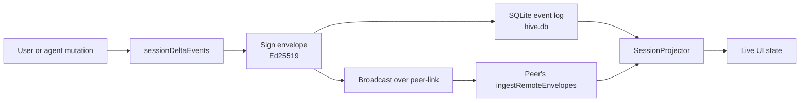

# Workspaces & chats

A **workspace** is a folder on disk Hive treats as the scope of all
its work. It carries a name, a permission policy, a set of vaults
and skills, a list of members and devices, and an event log.

A **chat** is a session inside a workspace — one conversation thread
with one or more agents.

## The model

```
Account ──── Device ──── Hive instance
                              │
                              └── Workspace (folder on disk)
                                     │
                                     ├── Chat (conversation thread)
                                     ├── Chat
                                     │
                                     ├── Members (humans + agents)
                                     ├── Vaults (knowledge bases)
                                     ├── Skills (injected instructions)
                                     ├── MCP servers (tool servers)
                                     └── Event log (SQLite)
```

- **Account** — a human (Alice). Stable identity, persists across devices.
- **Device** — a single machine (Alice's MacBook). Has its own Ed25519
  signing key, stored as a file seed in the app data dir (`keys/`) — see
  [Identity & devices](identity.md).
- **Hive instance** — the running app + its config.
- **Workspace** — a folder; one workspace per `hive.config.toml`.
- **Chat** — a conversation; many per workspace.

## The event log

Every meaningful state change — chat title rename, member add, tool
call, approval — becomes an event. Hive stores those events in an
**append-only SQLite database** (`hive.db` in the app's data
directory). Each envelope's full JSON is stored verbatim, with indexed
columns (`session_id`, `sequence`, `kind`, `scope`, `timestamp`) for
ordering and filtering.

Events get wrapped in a signed envelope (Ed25519 from your device
key) and appended to the log. The session projector replays events
to compute current state.



## Why event-sourced?

Three reasons:

1. **Sync.** Two peers can independently mutate state, then exchange
   envelopes, and the projector replays them to converge.
2. **Audit.** The log is the source of truth. Anyone with the
   workspace can replay history.
3. **Verification.** Signatures travel with envelopes; receiving
   peers verify against the writer's device public key.

## Workspace identity

The workspace's identity is its UUID + name + members + device
roster. The UUID is rolled at first launch and never changes. The
name + member list are mutable state in the event log.

Membership has two layers:

- The `WorkspaceMember` list (denormalized for UI, projected from
  events).
- The `DeviceIdentity` list (which device key belongs to which member).

The two together let the authz layer answer: "did the device that
signed this envelope have permission to do that?"

## Multiple workspaces

You can have many workspaces. The **workspace rail** on the far left
switches between them — the local "My workspace" and any team rooms
you've joined; the ＋ at the bottom creates a new team room or joins one
by invite code. The chat list is scoped to whichever workspace is active.

## Permissions & review

Hive doesn't have an inline per-tool consent prompt of its own. Trust is
enforced where the real seams are:

- **MCP servers are inert until enabled.** An API runtime has no tools until
  you turn some on for the chat, in the Tools pane.
- **Claude Code brings its own permission mode**, which governs its file and
  command actions.
- **Agent changes surface as proposals.** Edits appear in the **Diff** tab and
  the **Review** pane, where members approve (and reach quorum, if configured)
  before they're implemented.

The `[permissions]` presets in `hive.config.toml` (read/write/run/vault/
network/remote-runtime capability flags) carry this policy as workspace data;
review decisions are recorded as events and sync to peers.

## Vaults & skills

- **Vaults** are reference-material sources the runtime can search and
  reference. Kinds are **GitHub**, **GitLab**, and **HTTPS** — a repo path or
  a raw URL, not local folders or Obsidian libraries.
- **Skills** are instruction bundles injected into the active participants'
  system prompt (e.g. "you're a Swift code reviewer, prefer terse
  explanations").

Both are managed in the right-rail **Vaults** and **Skills** panes (install,
list, remove), **not** through `hive.config.toml` and **not** in Settings tabs.
