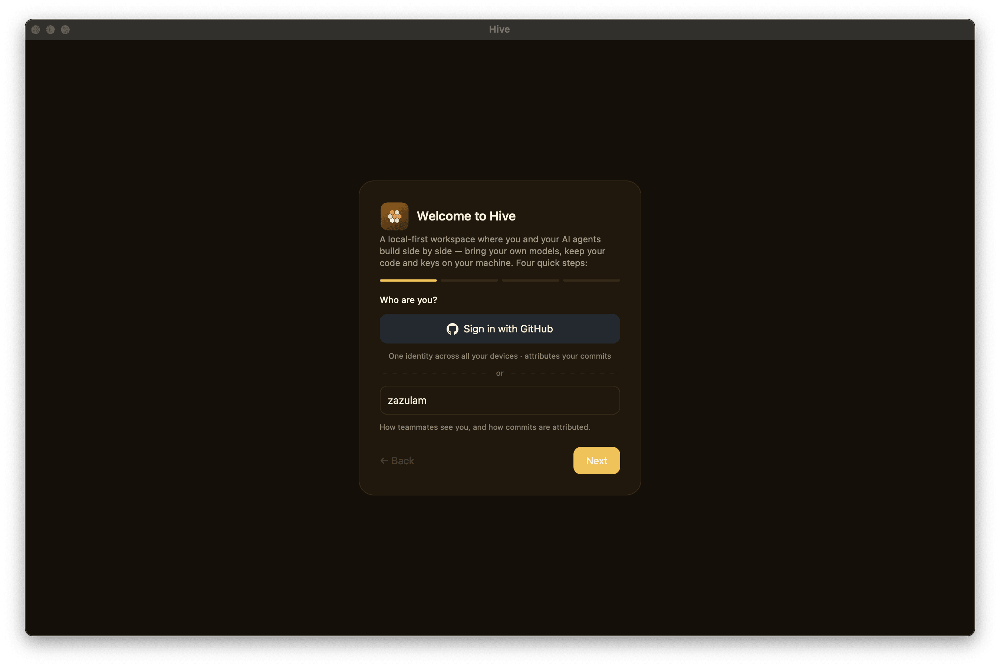

# Onboarding

Hive's first-launch wizard — "Four quick steps" — appears
automatically the first time you open the app, before you've picked a
name. It's gated on your identity, not on any config file: it shows
whenever your display name is still unset (or the placeholder `You`)
**and** the `hive.onboarded` flag in localStorage is absent. Finishing
(or skipping) the wizard sets that flag so it won't reappear.

| Step           | Captures                                             |
|----------------|------------------------------------------------------|
| Identity       | Display name **or** sign in with GitHub              |
| Project folder | The workspace folder agents work in                  |
| Runtime        | One agent (Claude Code / OpenAI-compatible / Anthropic API key / Ollama) + "let agents edit files" |
| Team           | Optional relay URL + team name for sync              |

{ width="700" }

There is no separate Welcome, Permissions, or Finish/Review screen —
identity is the first thing you see, and the last step's **Finish**
button saves everything. The runtime picker offers Claude Code,
OpenAI-compatible (OpenAI/OpenRouter/local), an Anthropic API key, and
Ollama (shown only when a local Ollama daemon is detected); aider and
pi are configured later from Settings, not here. The **"Let agents
edit files in my project"** checkbox maps to Claude Code's permission
mode — checked is `acceptEdits`, unchecked is read-only `default`.

The wizard persists your settings and identity into the app data dir
(`com.hive.desktop/`): public account/device records as JSON, private
key seeds under `keys/`, and `settings.json` (including any API key you
paste). (Key seeds are files, not in the OS keystore — see
[Identity & devices](../concepts/identity.md).)

## Re-running onboarding

Because the wizard is gated on your identity plus the `hive.onboarded`
localStorage flag, it won't return just because you edit or delete a
config file. The supported way to start over is **Settings → Account →
Danger zone → "Reset local data"**, which wipes this device's chats,
identity, keys, settings, and workspaces and relaunches Hive fresh into
the wizard.

## Headless / pre-seeded config

You can pre-populate runtimes and transport by shipping a
`hive.config.toml` in your workspace root; the Settings UI is a GUI
over the same fields. Note this does **not** skip the wizard on its
own — onboarding still runs until an identity (display name) exists.
Minimum viable config:

```toml
[app]
name = "Hive"
local_mode = true
sync_mode = "local"
default_runtime = "anthropic"
default_model = "claude-sonnet-4-5"

[transport]
kind = "local"

[sync]
enabled = false
server = ""
device_name = "my-mac"
end_to_end_encryption = true

[retrieval]
mode = "manual"
top_k = 8
chunk_size = 1200
keyword_weight = 0.35
semantic_weight = 0.65
recency_bias = false

[[runtimes]]
id = "anthropic"
name = "Anthropic"
provider = "anthropic"
kind = "remote"
endpoint = "https://api.anthropic.com"
preferred_model = "claude-sonnet-4-5"
supports_tools = true

[chat_defaults]
permission_preset = "default"
retrieval_mode = "manual"
show_context_panel = true
show_activity_panel = true
```

See the [Configuration reference](../reference/config-toml.md) for
the full schema.
