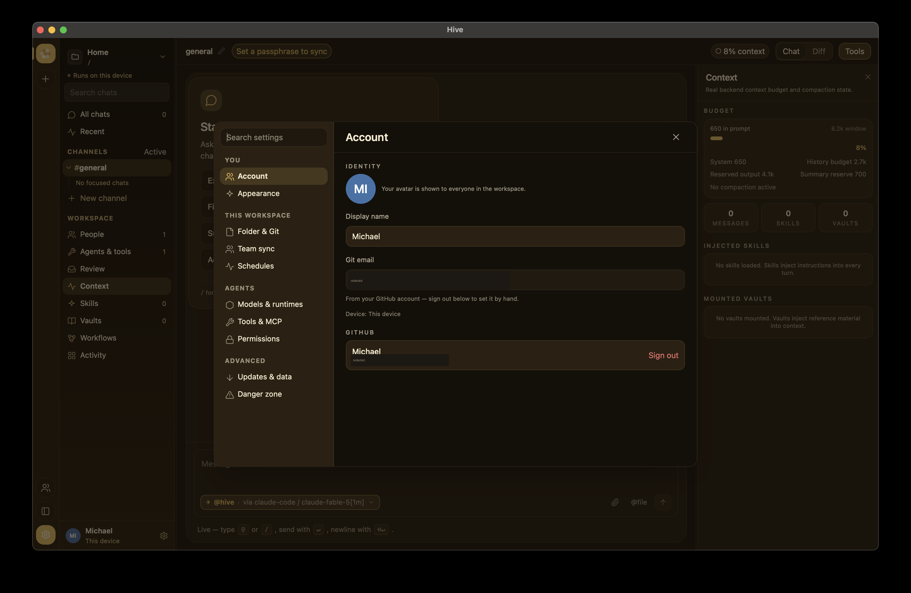

# Settings

Hive's Settings view is organized into **tabs**, so the page isn't one
overwhelming scroll — only the active tab mounts. The tabs are
**Account**, **Appearance**, **Folder & Git**, **Team sync**,
**Schedules**, **Models & runtimes**, **Tools & MCP**, **Permissions**,
**Updates & data**, and **Danger zone**. Workspace-scoped config
(runtimes, MCP servers) is written back to `hive.config.toml`; connection
settings persist to a `settings.json` in the app data dir; the theme is
stored locally per device.

{ width="900" }

## Account

- **Identity** — your **display name** (part of the `(@handle, device)`
  pair Hive signs envelopes with) and your **git email**. When you're
  signed in to GitHub the git email is managed from the account (sign
  out to edit it by hand).
- **GitHub** — sign in with GitHub (OAuth device flow) for a stable
  identity across all your devices and to invite teammates by
  `@handle`. The same GitHub account on your laptop and desktop resolves
  to **one member, two devices**. See
  [Identity & devices](../concepts/identity.md). Official builds ship
  with the OAuth App client id baked in; forks can paste their own.

## Appearance

- **Mode** — `Auto` (follows your OS light/dark setting, any platform),
  `Light`, or `Dark`.
- **Theme** — the accent family: **pollen** (the honey-gold default),
  **studio** (neutral graphite), **harbor** (ocean blue), **meadow**
  (green), or **midnight** (deep indigo). Each has a light and a dark
  variant; the mode picks which.

## Folder & Git

The workspace **root path** (drives the Diff canvas + git integration),
a one-line git status (current **branch** + **changed-file count**), and
an **Open in editor** shortcut. See [Git integration](git.md).

## Team sync

Everything needed to share a workspace, editable at runtime (applied
within a few seconds, no restart). Teams are normally created/joined
from the **workspace rail's ＋ button** (which generates the room, key,
and a shareable code); this tab is the manual/advanced surface and the
relay configuration:

- **Relay URL** — peers on the same relay + room converge. Blank =
  local-only. Use the **https base origin** (e.g. `https://relay.example`)
  — no `/v1` suffix, no `wss://`.
- **Relay access token** — needed **only** for a gated/paid hosted
  relay; leave blank for a relay you host yourself (the open default).
  Sent as a bearer on every relay request; never echoed back. If your
  token was issued as `name:token`, either form works — Hive sends just
  the token part.
- **Test connection** — actually hits the relay and reports
  **Connected**, **Unauthorized** (reached it, token rejected), or
  **Unreachable**. The status card above it only means a URL is
  *configured*; the probe is the source of truth for whether it works.
- **Room** + **Workspace key** (under *Advanced*) — the room id and the
  shared passphrase → end-to-end encryption; the relay sees only
  ciphertext (status shows `🔒 encrypted`).

See [Self-hosting a relay](../networking/self-host.md), the
[small-team deployment guide](../ops/deployment.md), and the
[pricing tiers](../ops/pricing.md).

### Team members

{ width="800" }

On a relay that supports it, the Team sync tab also has a **Team
members** panel for managing who may sync — durable, with no redeploy and
instant revocation:

- **Add member** — give a name (and optionally their GitHub login); Hive
  creates the user on the relay and shows a **one-time access token**.
  Copy it now — it's never shown again — and the teammate pastes it into
  the **Relay access token** field of *their* Hive.
- **Add token** — issue an extra token for an existing member (e.g. a
  second device).
- **Revoke** — kill one token immediately; the device using it stops
  syncing at once.
- **Disable / Enable** — turn a whole member off (revokes all their
  tokens at once) without deleting them.

Tokens are stored on the relay only as hashes — Hive shows the raw value
once and never again. This panel appears only when you're an **admin**
on a relay that supports user management (your GitHub login is in the
relay's admin list); everyone else sees a short explanatory note
instead. Managing members needs you signed in to GitHub
(Settings → Account). See
[Managing relay access](../networking/self-host.md#managing-relay-access).

## Schedules

Define **scheduled agents** — recurring runs that kick off a chat turn
on a cron-like schedule without you present. See
[Scheduled agents](scheduling.md) for the full walkthrough.

## Models & runtimes

LLM access is organized as a hierarchy:

- **Providers** — `anthropic`, `openAI`, `openRouter`, `ollama`,
  `azure` (Azure OpenAI), `custom`, plus the CLI coding agents: `claude`
  (**Claude Code**), `pi`, `aider`, **Codex** (OpenAI's `codex exec`), and
  **Hermes** (any stdin-driven CLI — set the executable + flags on the
  runtime). API providers hold their **own API key** and optional base URL
  (so multiple providers can have distinct keys, including any generic
  OpenAI-compatible endpoint); the CLI agents use their own login and need
  no key.
- **Models (runtimes)** — a model on a provider (id + capability flags).
  The add form includes an optional **Context window in tokens** — set
  it for Ollama/custom models whose window Hive can't infer from the
  name; the [context planner](voice-and-slash.md) budgets against it.
- **Agents** — reusable personas (name + model/runtime + role +
  instructions) you can attach to any chat.

The default runtime is the **`claude` CLI** — no API key needed, it uses
your Claude subscription. See
[Configuring a runtime](../getting-started/configuring-a-runtime.md).

### Context commands

The instructions behind `/summarize` and `/compact` are editable here —
blank uses the built-in default (shown as the placeholder). The
`/summarize` instruction also guides the automatic summarization of
overflowed history. See
[Managing context](voice-and-slash.md#customizing-the-instructions).

## Tools & MCP

Install / enable / remove **Model Context Protocol (MCP) servers**. An
installed server stays **inert until you enable it** — enabling is what
launches the command or opens the connection, and only enabled servers
expose their tools to agents. Two transports: `stdio` (Hive spawns the
binary) and `http`. See [MCP servers](../addons/mcp.md).

## Permissions

How agents are allowed to touch files — and this differs **per agent
type** (Claude Code is not the only agent that edits files):

- **`claude` permission mode** — `Read-only` (default; proposes edits
  but blocks writes), `Accept edits` (can write files), or `Bypass all`
  (also runs shell commands). Injected as `--permission-mode` into the
  `claude` CLI, which runs headless and can't show an interactive
  prompt.
- **aider / pi** gate via their own flags.
- **API/MCP-backed agents** can only call the MCP tools you've
  **enabled** on the Tools & MCP tab — an installed-but-disabled server
  is inert, so nothing runs until you turn it on.

## Updates & data

- **Check for updates** — the auto-updater is scaffolded and activates
  at public launch (for signed builds); on current unsigned dists it's
  inert. A lightweight version check still notifies you when a newer
  release is published.
- **Export data** — download a copy of this device's local data.

## Danger zone

**Reset local data** wipes this device's chats, identity, keys,
settings, and workspaces, then relaunches Hive fresh. It's the supported
way to start over — uninstalling leaves data behind. See
[Reset local data](../getting-started/first-launch.md#reset-local-data)
for the per-OS data directories.

## Notes

- New chats are **auto-titled** from the opening exchange using the
  chat's primary runtime — no setting required. Rename any chat with the
  ✎ pencil next to its title.
- **System tray / menu bar** — the tray icon's menu jumps straight to
  **Friends**, **Team & Relay Sync** (this page's Team sync tab), and
  **Settings**, besides showing/quitting the app.
- **Focus mode** — collapse the sidebar with **⌘B** (or the panel button
  at the bottom of the workspace rail) and the tools rail with **⌘J** (or
  the **Tools** button in the chat header). Both persist across restarts,
  and both live in the ⌘K palette as "Toggle sidebar" / "Toggle tools
  rail".
- Workspace config round-trips through the TOML encoder, so hand-edited
  and GUI-edited `hive.config.toml` files stay compatible (comments
  aren't preserved). See
  [`hive.config.toml` reference](../reference/config-toml.md).
