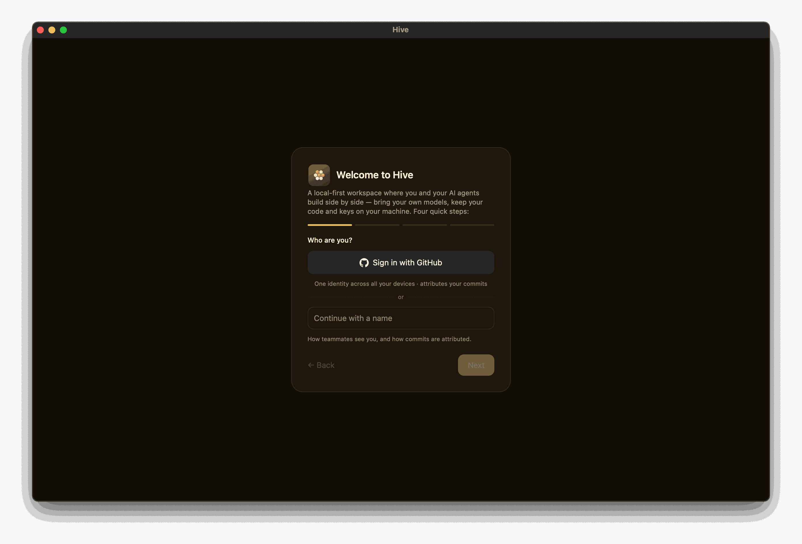

# First launch

Hive ships as an unsigned desktop app (macOS / Windows / Linux). On first launch
you'll see a guided onboarding wizard that captures your identity, picks a
workspace folder, and configures a runtime.

{ width="720" }

## Install

Grab a bundle for your OS, or build from source:

```bash
git clone https://github.com/honeyhive-ai/hive.git
cd hive
cargo tauri build        # bundles for the current OS → target/release/bundle/
# or a fast dev loop without bundling:
cargo tauri dev
```

See [Building the dist](../ops/build.md) for per-OS details and cross-builds.
Because builds are unsigned, first launch needs a nudge:

- **macOS:** right-click → **Open** (or `xattr -dr com.apple.quarantine /Applications/Hive.app`).
- **Windows:** SmartScreen → **More info → Run anyway**.
- **Linux:** `chmod +x Hive_*.AppImage && ./Hive_*.AppImage`.

## Wizard steps

The onboarding is **four quick steps** (the progress dots at the top count
them off):

1. **Identity** — enter a display name, **or sign in with GitHub** (see
   below) for one identity across all your devices. Either way Hive
   auto-generates an Ed25519 device key behind the scenes; you never
   see it directly.
2. **Project folder** — pick a folder on disk. Hive treats this as the
   root; everything agents do (file edits, command runs, git
   operations) is scoped to this directory.
3. **Runtime** — choose the agent that generates replies: **Claude
   Code**, an **OpenAI-compatible API** (OpenAI / OpenRouter / any
   local OpenAI-style server), an **Anthropic API key**, or **Ollama**
   (offered only when a local Ollama daemon is detected). Hive defaults
   the selection to whatever it finds installed. A **"Let agents edit
   files in my project"** checkbox sets Claude Code's permission mode —
   checked lets agents write files (`acceptEdits`), unchecked is
   read-only. You can add aider, pi, or more runtimes later from
   Settings.
4. **Team** — optional. If you have a relay endpoint, paste it here
   (and optionally name a team) so cross-network peers can sync. Skip
   to stay solo/local; you can add a relay later from Settings.

{ width="720" }

There's no separate Welcome, Permissions, or Finish/Review screen —
identity is the first thing you see, and the last step's **Finish**
button saves everything.

## What gets written

After onboarding:

- The app data dir `com.hive.desktop/` — your account + device
  records (public bits) as JSON, private key seeds under `keys/`, and
  `settings.json` (runtime/provider config, including any API keys you
  paste into Settings).
- `<workspace>/hive.config.toml` — optional file-based runtime +
  transport config.
- `<workspace>/.hive/` — the workspace's event store (signed envelopes)
  and per-session state.

Everything is local. Nothing leaves your machine unless you
explicitly configure a transport (relay endpoint or LAN discovery
toggle).

## Sign in with GitHub

You can use Hive anonymously with just a local device identity, but
**signing in with GitHub** (during onboarding or later in **Settings →
Account**) gives you:

- **One account identity across devices** — the same GitHub account on
  your laptop and desktop resolves to one member, two devices.
- **Attributed commits** — git commits Hive makes on your behalf are
  attributed to you.
- **Reach teammates by `@handle`** — invite and add collaborators by
  their GitHub username.

Sign-in uses GitHub's **device flow**: Hive shows a short code, you enter
it on github.com, and approve. Official builds ship with the OAuth App
client id baked in; if you build a fork yourself, paste your own OAuth App
client id in the sign-in panel.

See [Identity & devices](../concepts/identity.md) and
[Collaborators, presence & DMs](../features/collaborators.md).

## Reset local data

To start completely over on a device, use **Settings → Account → Danger
zone → "Reset local data"**. It wipes this device's chats, identity, keys,
settings, and workspaces, then relaunches Hive fresh.

This is the **supported way to start over** — uninstalling the app leaves
your data behind on disk. If you ever need to clean up manually, Hive's
data directory is:

| OS | Path |
|---|---|
| macOS | `~/Library/Application Support/com.hive.desktop` |
| Windows | `%APPDATA%\com.hive.desktop` (plus `%LOCALAPPDATA%\com.hive.desktop` for the WebView2 cache) |
| Linux | `~/.local/share/com.hive.desktop` |

!!! danger "Reset is irreversible"
    Reset local data cannot be undone. Anything not synced to a peer or
    pushed to git is gone. Back up your workspace folder first if in doubt.

## Next steps

- [Configure additional runtimes](configuring-a-runtime.md)
- [Start your first chat](first-chat.md)
- [Set up a relay so peers can find you](../networking/self-host.md)
