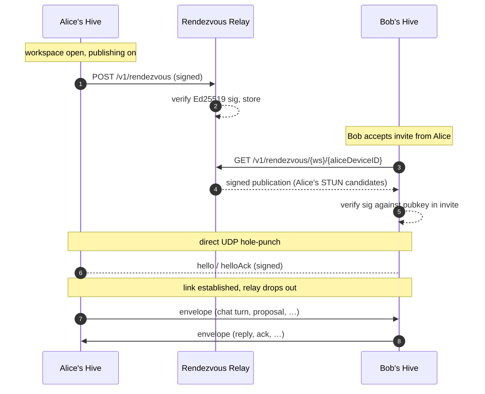

# Rendezvous relay

!!! note "Roadmap — not in the current build"
    Direct peer-to-peer (STUN candidate exchange + UDP hole-punch) is a tracked
    follow-up. Today the relay (`crates/hive-relay/`) **forwards encrypted event
    envelopes** between peers instead of brokering a direct connection — see
    [Self-hosting a relay](self-host.md). This page documents the planned
    rendezvous design.

The **rendezvous relay** is Hive's smallest possible coordination
point for cross-network peers. Two Hive instances on different
networks each publish their STUN-discovered candidates to the
relay; each looks the other up by `(workspaceID, deviceID)`; the
relay drops out of the data path once they connect direct.

The relay never sees content. It sees workspace UUIDs, device
UUIDs, device public keys, and STUN IP+port pairs.



## The protocol

Three endpoints. Full `/v1` spec in the relay repo,
[github.com/honeyhive-ai/relay](https://github.com/honeyhive-ai/relay):

### `POST /v1/rendezvous`

Publish a `RendezvousPublication`:

```json
{
  "record": {
    "workspaceID": "uuid",
    "publisherAccountID": "uuid",
    "publisherDeviceID": "uuid",
    "publisherSigningPublicKey": "base64",
    "candidates": [
      { "kind": "stunReflexive", "host": "203.0.113.5",
        "port": 51820, "priority": 100 }
    ],
    "publishedAt": "ISO8601",
    "ttlSeconds": 90
  },
  "signature": "base64-Ed25519-over-canonical-preimage"
}
```

The relay verifies the Ed25519 signature against the
`publisherSigningPublicKey` over the canonical preimage of the
record. Bad sig → 400. Stale publish (>5 min skew) → 400. Otherwise
it stores the publication, capped at the relay's
`--max-ttl` (default 300s) regardless of what the client requested.

### `GET /v1/rendezvous/{workspaceID}/{deviceID}`

Look up the freshest publication for a peer. 404 if none.

### `GET /v1/rendezvous/{workspaceID}`

Look up every fresh publication for the workspace as an array. Used
when a client wants to find "anyone currently online in this
workspace."

## Why it works

The cryptography does the heavy lifting:

- The relay can't forge publications — it doesn't have any device's
  private key.
- The relay can't replay an expired publication — `publishedAt` is
  signed and the receiver checks freshness.
- The relay can refuse to serve specific publications (denial of
  service), but it can't substitute fake ones.

If you don't trust your relay, run your own —
[Self-hosting](self-host.md).

## TTL & republishing

Publications expire after `ttlSeconds`. Hive republishes every ~60
seconds while a workspace is active. This means:

- A peer who joins finds you within 60s of you opening the
  workspace.
- If you close Hive, your publication evicts within 90s and peers
  stop finding you.
- Network address changes (Wi-Fi switch, router reboot) update
  within the next publish cycle.

## Failure modes

- **STUN unreachable** — Hive publishes a `hostLocal` candidate
  instead. Peers on the same LAN can still reach you; peers across
  NAT can't (the relay can fall back to TURN-style forwarding —
  see [TURN fallback](turn.md)).
- **Relay unreachable** — peers can't find each other through this
  workspace until the relay returns. Existing live links keep
  working.
- **Clock skew** — if your local clock is >5 min off the relay,
  every publish fails with `400 publishedAt out of skew window`.
  Fix: `sudo sntp -sS time.apple.com`.

## Federation

Two relays federate by mirroring each other's publications.
Publications carry their own signatures, so re-hosting is
trust-free. The federation contract is intentionally not
prescribed — relay operators can choose webhook, long-poll,
gRPC, etc.

## See also

- [Self-hosting a relay](self-host.md) — full setup instructions.
- [TURN fallback](turn.md) — what happens when direct dial fails.
