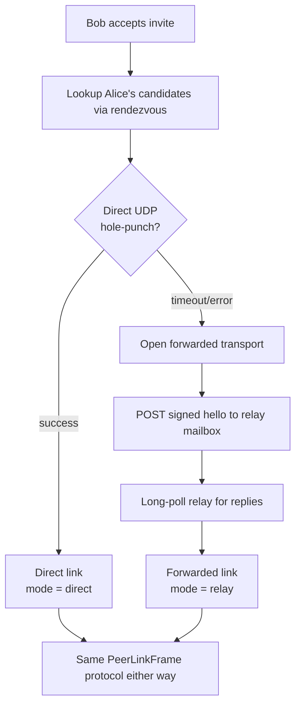

# TURN-style fallback

!!! note "Roadmap — not in the current build"
    TURN-style frame forwarding belongs to the direct-P2P stack, which is a
    tracked follow-up. Today multiuser runs entirely through the relay's
    envelope-forwarding endpoint (see [Self-hosting a relay](self-host.md)); this
    page documents the planned fallback.

About 20% of real-world NAT pairs defeat UDP hole-punching even
with STUN. Symmetric NATs on both ends, restrictive corporate
firewalls, mobile carriers that rewrite ports per destination —
all break direct dial.

For those cases the rendezvous relay also acts as a **TURN-style
forwarder**: peers route opaque `PeerLinkFrame` bytes through the
relay's mailbox endpoints. The relay never decodes a frame; it
just shuttles bytes.

## Wire shape

Two endpoints, in addition to the rendezvous trio:

### `POST /v1/forward/{workspaceID}/{recipientDeviceID}`

Body: opaque bytes (typically `PeerLinkCodec.encode(frame)`
output — length-prefixed). The relay appends to the recipient's
mailbox. Max body size: 1 MiB.

### `GET /v1/forward/{workspaceID}/{recipientDeviceID}`

Long-poll. Drains the mailbox.

- 204 → mailbox empty.
- 200 → concatenated queued frames (each still length-prefixed —
  feed straight into `PeerLinkCodec.decodeOne`).

Mailboxes evict after 5 minutes idle.

## When the client uses it



The client only falls back to the forwarding path when direct
dial fails. The decision tree:

```
PrototypeStore.dialPeerDirect(publication)
│
├── direct UDP to candidate succeeds
│     → return PeerIdentity, mode = "direct"
│
└── direct dial failed (timeout / connection error)
      → openForwardedLink(publication)
        → return PeerIdentity, mode = "relay"
```

The People pane labels each active peer link with its mode so the
user can tell. Performance — direct adds ~5-10ms over the LAN
baseline; relay-forwarded adds the relay's RTT one extra hop.

## Same protocol on top

The peer-link wire format is unchanged. The same signed
`PeerLinkHello` / `PeerLinkHelloAck` handshake runs. The same
`PeerLinkFrame.envelope` carries workspace events. The same
backfill request/response works on link-up. Only the **transport**
flips from direct UDP to relay-forwarded HTTP.

This means content sync, agent invocation routing, consent
brokering — every higher-level protocol — runs identically whether
peers are direct or relayed.

## What the relay sees

Same as the rendezvous side, **plus** the opaque frame bytes:

- Metadata: workspace+device tuples, frame timing, frame sizes.
- Content: the bytes are encrypted-at-the-application-layer
  envelopes; the relay can't read them.

The relay still can't forge frames — frames come from peers it
doesn't have keys for, so any tampering invalidates the
envelope's signature when it lands.

## Performance budget

The relay is intentionally simple. Forwarded mode adds:

- ~1 round-trip per frame on the send side.
- Up to `pollInterval` (500ms default) latency on the receive
  side, because the client long-polls.

For chat-cadence workloads (one frame every few seconds) this is
unnoticeable. For real-time collaborative typing it would feel
laggy — collaborative typing today happens against a directly
connected peer, not a relay-forwarded one.

## Threat model recap

The forwarding path doesn't change the trust story. The relay
operator:

- ✅ Can see metadata about peer connections.
- ✅ Can DoS specific peers by refusing their mailboxes.
- ❌ Cannot read content.
- ❌ Cannot impersonate a peer.
- ❌ Cannot inject envelopes into the log (signature verification
  catches forgery).

The threat model is identical to rendezvous-only mode — adding
the forward endpoints doesn't grant the relay any new capability.
