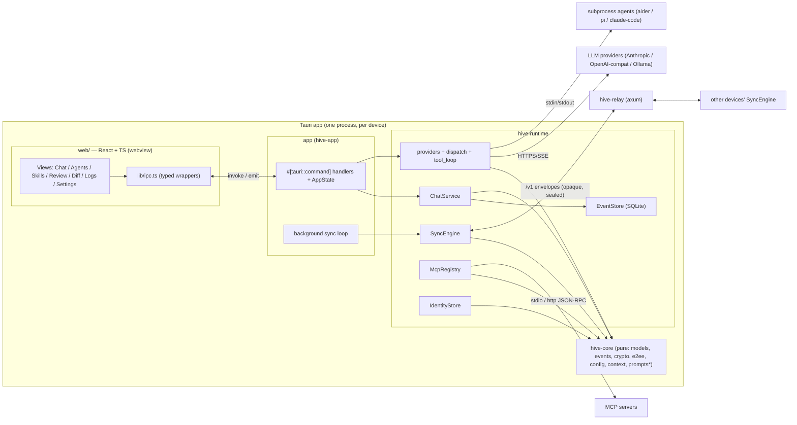
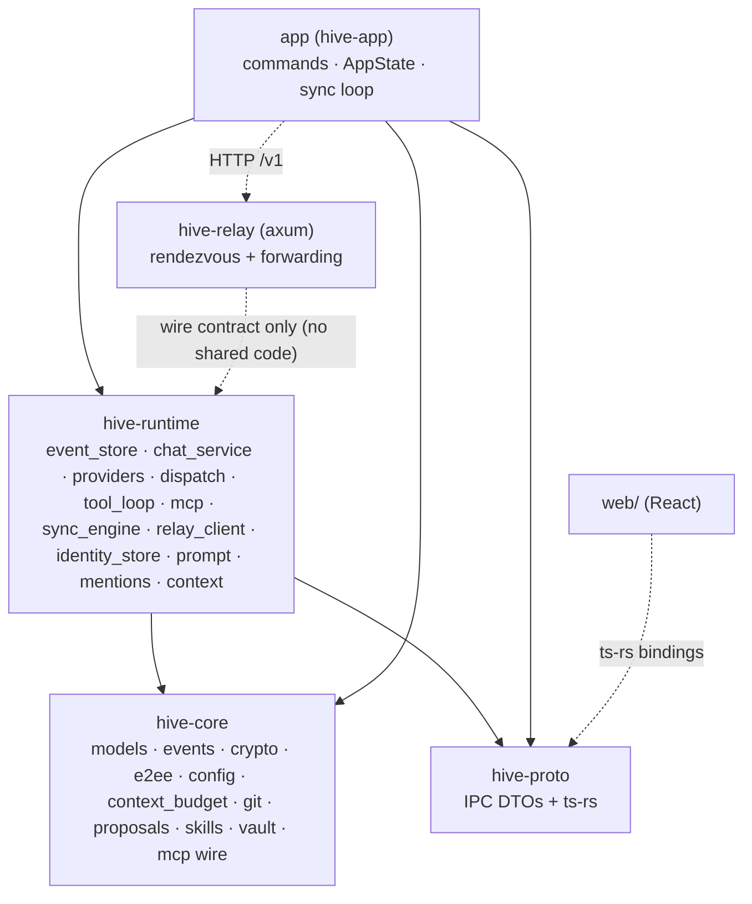
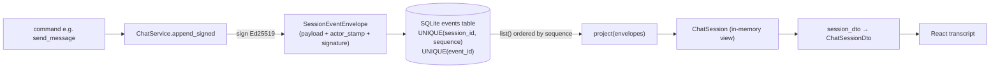
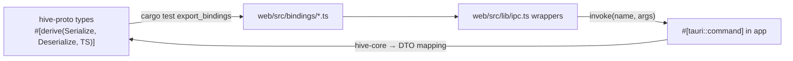
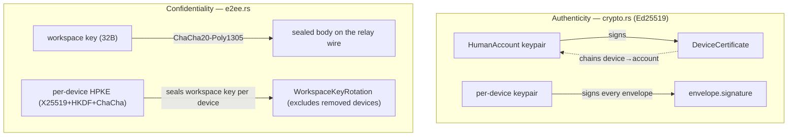
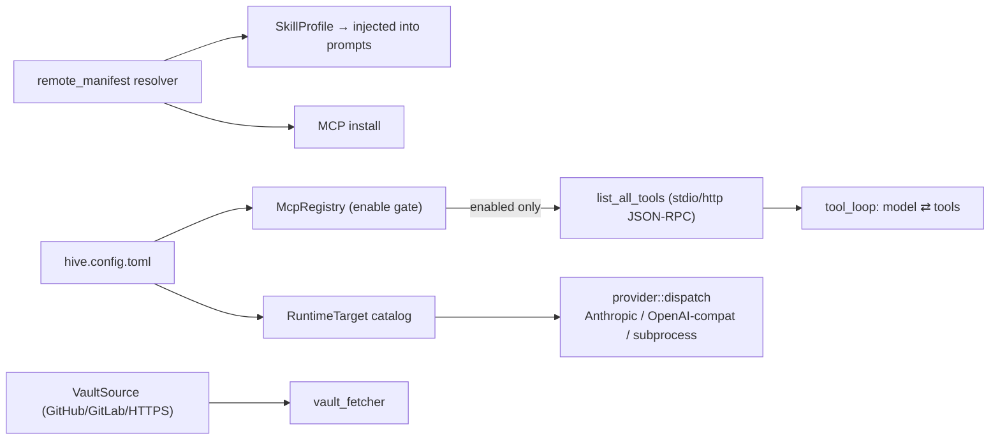

# Hive architecture (Rust + Tauri) — developer guide

How Hive fits together: the crates, the data flow, and the invariants. This is the
"inner workings" reference.

Mermaid diagrams below render on GitHub and in the mkdocs site.

---

## 1. System shape

A single Tauri v2 process hosts a **React/TypeScript** frontend (webview) and the
**Rust backend** in-process. They talk over **Tauri IPC** (commands = request/reply,
events = push). Multiuser goes through a separate **relay** (`hive-relay`).



\* prompt assembly / mentions / context-compaction live in `hive-runtime` (they
compose `hive-core` types); pure domain logic lives in `hive-core`.

---

## 2. Crates & dependency direction



Rule of thumb: **`hive-core` is pure and dependency-light** (serde + crypto, no IO,
no tokio). Anything that does IO, spawns processes, or hits the network lives in
**`hive-runtime`**. **`app`** is glue: it owns `AppState`, maps domain types
to `hive-proto` DTOs, and wires the background tasks. The **relay shares no code**
with the client — only the `/v1` HTTP contract.

---

## 3. Event sourcing — the source of truth

Session state is never mutated directly. Every change is a signed
`SessionEventEnvelope` appended to SQLite; the current `ChatSession` is the
**projection** of that ordered stream.



- `SessionEvent` is an **idiomatic Rust enum** (variant per kind), not Swift's
  optional-bag struct; the projector (`ChatSession::apply`) is an exhaustive match.
- Events are designed to be **commutative/idempotent** where possible (message
  upsert by id, member upsert, idempotent reactions) so out-of-order/merged streams
  converge — this is what makes relay sync work without a full CRDT.
- `kind_str()` + `scope()` drive the SQLite `kind`/`scope` columns and the
  workspace-vs-session log split.

---

## 4. A chat turn, end to end

```mermaid
sequenceDiagram
  participant U as React (ChatView)
  participant C as send_message (app)
  participant S as ChatService
  participant W as windowed_context + prompt + mentions
  participant D as provider::dispatch
  participant L as LLM / subprocess
  participant E as EventStore

  U->>C: invoke send_message(sessionId, body)
  C->>S: post_user_message (append signed MessageAppended)
  C->>W: assemble system prompt (roster+skills), parse @mentions,<br/>window history to model budget (+ summarize overflow)
  Note over C,W: a single @agent mention answers in that agent's identity;<br/>responder runtime resolved from config (BYO)
  C->>S: begin_assistant_message (streaming placeholder)
  alt MCP tools enabled & Anthropic
    C->>D: tool_loop: model ⇄ tool_use ⇄ tool_result (bounded)
    D->>L: run_messages(tools)
  else plain streaming
    C->>D: stream_reply
    D-->>C: deltas
    C->>E: append MessageChunkReceived (per delta)
    C-->>U: emit chat://stream {delta}
  end
  C->>S: complete_assistant_message (MessageCompleted)
  C-->>U: emit chat://stream {completed}
  Note over C: reply mentions another @agent → cascade (bounded);<br/>reply @you-mentions a human → native notification
```

---

## 5. IPC contract & type safety



The frontend never imports `hive-core` types directly — it consumes flat,
camelCase **DTOs** from `hive-proto`, generated to TypeScript by **ts-rs**. CI runs
`cargo test -p hive-proto export_bindings` and fails if `web/src/bindings/` drifts,
so the contract can't silently break. Bindings are committed.

---

## 6. Multiuser sync (relay forwarding + E2EE)

Each device runs a background loop that pushes new local envelopes and pulls remote
ones into its own SQLite connection (WAL). The relay is **content-blind**.

```mermaid
sequenceDiagram
  participant A as Device A (SyncEngine)
  participant R as hive-relay
  participant B as Device B (SyncEngine)

  Note over A,B: same HIVE_RELAY_URL + HIVE_WORKSPACE (room); optional HIVE_WORKSPACE_KEY
  A->>A: take_unpushed (local events not yet sent)
  A->>A: seal each w/ workspace key (ChaCha20-Poly1305) [if key set]
  A->>R: POST /v1/workspaces/{room}/envelopes (ciphertext)
  B->>R: GET /v1/workspaces/{room}/envelopes?after=cursor
  R-->>B: opaque bodies (ciphertext)
  B->>B: open w/ key → SessionEventEnvelope; ingest (dedup by event_id)
  B->>B: project → UI; emit workspace://synced
  Note over B: wrong/no key ⇒ body skipped (room can't poison the store)
```

Ordering = relay server-sequence on fetch + local ingestion order; the commutative
projector tolerates it. Dedup is by `event_id` (so re-pushes/restarts are
harmless). Direct P2P (STUN/hole-punch via the rendezvous board) is a future
optimization; relay forwarding is sufficient for multiuser.

---

## 7. Cryptography

Two independent layers, both in `hive-core`:



- **Signing** (live): every event is signed by the writing device; `EnvelopeVerifier`
  verifies on read and quarantines bad signatures.
- **Sealing on the wire** (live, opt-in): shared `HIVE_WORKSPACE_KEY` → symmetric
  seal so the relay sees only ciphertext.
- **Per-device HPKE + rotation** (built + tested): the path for distributing the
  workspace key without a shared secret; wiring to membership exchange is a
  follow-up.
- Private keys live in a `KeyVault` (file-backed now; OS keystore at packaging).

---

## 8. Extensibility: MCP, skills, vaults, providers



**Security gate (carried from Swift):** an MCP server is **inert until explicitly
enabled** — `McpRegistry` never launches/connects a disabled server. Enabling is
what opens the connection.

---

## 9. Key invariants (don't break these)

| Invariant | Where enforced |
|---|---|
| All state changes go through signed events; UI reads projections | `ChatService.append_signed`, `events::project` |
| Append-only; dedup by `event_id`; per-session `sequence` unique | `EventStore` schema + `ingest` |
| Frontend ↔ backend types come from `hive-proto` via ts-rs (CI-gated) | `hive-proto`, `rust-tauri.yml` |
| MCP servers inert until enabled | `McpRegistry::enabled` / `list_tools` gate |
| Relay is content-blind (ciphertext with a workspace key) | `SyncEngine::encode/decode` |
| `hive-core` stays pure (no IO/tokio/network) | crate boundary |
| Bad signatures quarantined, never projected | `envelope_verifier` |

---

## 10. Where to start reading

- A feature touching state → `hive-core::events` (add a variant + projector arm) →
  `ChatService` (a signed write path) → a command in `app` → a DTO in
  `hive-proto` (regen bindings) → a view in `web/`.
- A new provider → `hive-runtime::provider` + a `dispatch` arm.
- A new MCP/skill/vault source → `hive-runtime::{mcp, remote_manifest, vault_fetcher}`.
